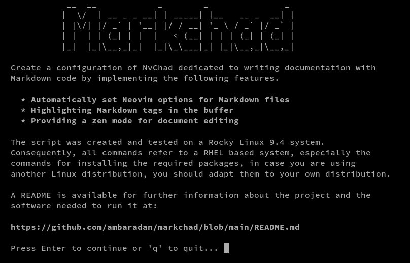

# Markchad

**NOTE**: Rocky Linux 9.4 is the development platform for Markchad. The following should work for any Linux operating system derived from RHEL. If you are not on RHEL or a clone, adjustments will be needed for your operating system.

 **Disclaimer**: The developer of the Markchad scripts and files guarantees them for no purpose whatsoever. Use them at your own risk. That said, the script is tested by the developer and others, and it is believed to function for the desired purpose of creating a Neovim configuration for writing in Markdown that works very well. Your feedback is welcome!

## Objective

Create a configuration of NvChad dedicated to writing documentation with Markdown code by implementing the following features.

* Automatically set Neovim options for Markdown files
* Highlighting Markdown tags in the buffer
* Providing a *zen mode* for document editing

## Introduction

[Nvchad](https://nvchad.com/) is a custom configuration of **Neovim** that provides *out of the box* an IDE for *Lua* code development, its modularity however allows useful features for the implementation of any type of language in the configuration.
This project intends to create a version of the NvChad configuration with the best solutions for the Markdown language provided by Neovim plugins and settings.
Features useful for project management, in terms of workspace management (file manager, session manager), and *git* repository management, are also available.

## Requirements

Installation of Markchad is by way of a script, which will check the availability of minimum requirements. To ensure you have them all, you can follow these steps ahead of Markchad installation. This instruction should work on any Rocky Linux, RHEL Linux, or clone, version 9 or above. If you are using a different Linux operating system, then you will need to extrapolate these instructions to fit your operating system. If you *do* create a new instruction for your operating system, consider pushing those changes here. You will also need `sudo` permissions throughout.

### Repositories

With the standard repositories, you will also need Extra Packages for Enterprise Linux (EPEL), and a Cool Other Package Repo (COPR) for `lazygit`:

```bash
sudo dnf install epel-release -y
sudo dnf copr enable atim/lazygit -y
```

### Packages

Install the packages:

```bash
sudo dnf install gcc make unzip compat-lua-libs libtermkey libtree-sitter libvterm luajit luajit2.1-luv msgpack unibilium xsel ripgrep sqlite pandoc rsync curl lazygit
```

### Neovim

You will need a modern, recent, version of Neovim. At the time of this writing, the version was 0.10.1. You can install Neovim [from source](https://github.com/neovim/neovim/blob/master/BUILD.md), or the [pre-compiled binary](https://github.com/neovim/neovim/releases/tag/v0.10.1) (recommended). Because of the fast-paced development cycle, RPM packages found in the Extra Packages for Enterprise Linux repository (EPEL) are many versions behind and will not work with Markchad.

If using the pre-compiled binary, you will need to adjust your `$PATH` variable in your user's `.bashrc` file. This procedure assumes you have installed Neovim in your home folder:

1. Edit your `.bashrc` file with your favorite editor.

2. Add the following at the bottom of the file:

    ```bash
    export PATH=~/nvim-linux64/bin/:$PATH
    ```

3. Prior to running `nvim`, run `bash` at the command line and then verify your path with the `echo $PATH` command. You should see the `/nvim-linux64/bin/` in your path. If you see this, you are ready for the next steps.

### Nerd fonts

For the proper display of icons, use the [Nerd Font installation procedure here](https://docs.rockylinux.org/books/nvchad/nerd_fonts/).

## Features

* **Configuration:** careful writing of all configurations of the additional plugins makes them independent of each other. This allows disabling them when needed by means of the *Plugin Spec* `enabled = false/true` of *lazy.nvim* present in all configuration files. Include in the configuration files are keyboard keys to invoke the various features and convert them where possible to the *lazy style* format.
* **UI - Interface:** some changes made to the layout strategy of `Telescope` to have a more modern and functional interface. Themes (*dropdown* and *ivy*) were also used for the `pickers` provided by default, and for those inserted by additional plugins.
Made no changes to the themes provided by *NvChad*. This allows you to use it according to your own aesthetic tastes. Not all themes offer a *rich* display for highlights and, implemented for graphic development, the default `onedark` theme is used.
* **Editor:** supplemented the section of plugins that provide functionality to the editor with a *git* repository manager, a session manager that enables faster project management, and other small utilities to improve workflow.
* **Markdown:** included several features for writing Markdown documentation including a preview of the document in the browser, highlighting in the buffer of markdown tags, conversion by keyboard keys of attributes to text, and more.

## Installation

1. Get the latest version of the Markchad archive with:
    `curl -L https://github.com/ambaradan/markchad/releases/latest/download/install_markchad.tar.gz --output install_markchad.tar.gz`

2. Extract the archive:
    `tar xzvf install_markchad.tar.gz`

3. Change into the directory called "markchad":

    `cd markchad`

4. Run the script:
    `./install.sh`

5. The Markchad splash screen appears. If you are ready to continue with the install, follow the on-screen directions:

    

6. The installation script provides two ways to install Markchad. You can install it as the default ("Nvim"), or if you prefer to keep your markdown editor separate from other work, using "Markchad."

    

All releases, and the changelog information for each, are available [on this page](https://github.com/ambaradan/markchad/releases).

## Acknowledgements

A big thank you goes to [Siduck](https://github.com/siduck), the main developer, and to all those who contributed to the creation of *NvChad*, without them this project could not exist.
A big thank you also goes to all the developers of the plugins used in this setup for sharing their knowledge.
