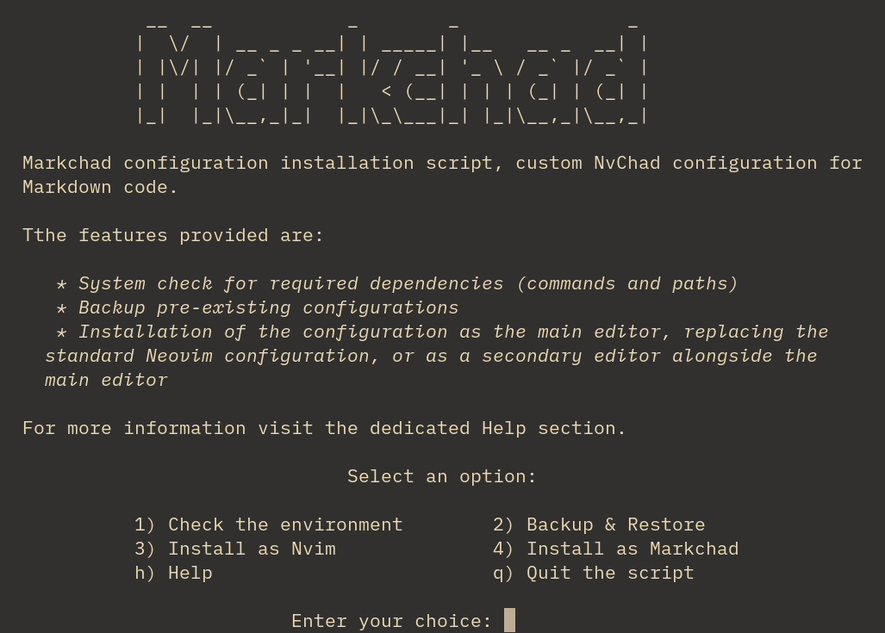

# Markchad

## Attention - development news

The *Markchad* project will not be further developed, instead a new configuration based on the standard version of Neovim and managed by the new plugin manager [rocks.nvim](https://github.com/nvim-neorocks/rocks.nvim) is being developed, the project is called *rocksmarker* and can be viewed at [this address](https://github.com/ambaradan/rocksmarker).

- [Markchad](#markchad)
    - [Objective](#objective)
    - [Introduction](#introduction)
    - [Requirements](#requirements)
        - [Repositories](#repositories)
        - [Packages](#packages)
        - [Neovim](#neovim)
        - [Nerd fonts](#nerd-fonts)
    - [Features](#features)
    - [Installation](#installation)
        - [Download the script](#download-the-script)
        - [Vale configuration](#vale-configuration)
    - [Mapping - Quick Reference](#mapping---quick-reference)
        - [Editor](#editor)
        - [Markdown](#markdown)
        - [Git Repository](#git-repository)
        - [Diagnostics](#diagnostics)
        - [Miscellaneous](#miscellaneous)
    - [Acknowledgements](#acknowledgements)

**NOTE**: Rocky Linux 9.4 is the development platform for Markchad. The following should work for any Linux operating system derived from RHEL. If you are not on RHEL or a clone, adjustments will be needed for your operating system.

 **Disclaimer**: The developer of the Markchad scripts and files guarantees them for no purpose whatsoever. Use them at your own risk. That said, the script is tested by the developer and others, and it is believed to function for the desired purpose of creating a Neovim configuration for writing in Markdown that works very well. Your feedback is welcome!

## Objective

Create a configuration of NvChad dedicated to writing documentation with Markdown code by implementing the following features.

- Automatically set Neovim options for Markdown files
- Highlighting Markdown tags in the buffer
- Providing a *zen mode* for document editing

## Introduction

[Nvchad](https://nvchad.com/) is a custom configuration of **Neovim** that provides *out of the box* an IDE for *Lua* code development, its modularity however allows useful features for the implementation of any type of language in the configuration.
This project intends to create a version of the NvChad configuration with the best solutions for the Markdown language provided by Neovim plugins and settings.
Features useful for project management, in terms of workspace management (file manager, session manager), and *git* repository management, are also available.

## Requirements

Installation of Markchad is by way of a script, which will check the availability of minimum requirements. To ensure you have them all, you can follow these steps ahead of Markchad installation. This instruction should work on any Rocky Linux, RHEL Linux, or clone, version 9 or above. If you are using a different Linux operating system, then you will need to extrapolate these instructions to fit your operating system. If you *do* create a new instruction for your operating system, consider pushing those changes here. You will also need `sudo` permissions throughout.

### Repositories

With the standard repositories, you will also need Extra Packages for Enterprise Linux (EPEL):

```bash
sudo dnf install epel-release -y
```

### Packages

Install the packages:

```bash
sudo dnf install gcc make unzip compat-lua-libs libtermkey libtree-sitter libvterm luajit luajit2.1-luv msgpack unibilium xsel ripgrep sqlite pandoc rsync curl tar git npm libicu
```

### Neovim

You will need a modern, recent, version of Neovim. At the time of this writing, the version was 0.10.1. You can install Neovim [from source](https://github.com/neovim/neovim/blob/master/BUILD.md), or the [pre-compiled binary](https://github.com/neovim/neovim/releases/tag/v0.10.1) (recommended). Because of the fast-paced development cycle, RPM packages found in the Extra Packages for Enterprise Linux repository (EPEL) are many versions behind and will not work with Markchad.

If using the pre-compiled binary, you will need to adjust your `$PATH` variable in your user's `.bashrc` file. This procedure assumes you have installed Neovim in your home folder:

1. Edit your `.bashrc` file with your favorite editor.

2. Add the following at the bottom of the file:

    ```bash
    export PATH=~/nvim-linux64/bin/:$PATH
    ```

3. Prior to running `nvim`, run `bash` at the command line and then verify your path with the `echo $PATH` command. You should see the `/nvim-linux64/bin/` in your path. If you see this, you are ready for the next steps.

### Nerd fonts

For the proper display of icons, use the [Nerd Font installation procedure here](https://docs.rockylinux.org/books/nvchad/nerd_fonts/).

## Features

- **Configuration:** careful writing of all configurations of the additional plugins makes them independent of each other. This allows disabling them when needed by means of the *Plugin Spec* `enabled = false/true` of *lazy.nvim* present in all configuration files. Include in the configuration files are keyboard keys to invoke the various features and convert them where possible to the *lazy style* format.
- **UI - Interface:** some changes made to the layout strategy of `Telescope` to have a more modern and functional interface. Themes (*dropdown* and *ivy*) were also used for the `pickers` provided by default, and for those inserted by additional plugins.
Made no changes to the themes provided by *NvChad*. This allows you to use it according to your own aesthetic tastes. Not all themes offer a *rich* display for highlights and, implemented for graphic development, the default `onedark` theme is used.
- **Editor:** supplemented the section of plugins that provide functionality to the editor with a *git* repository manager, a session manager that enables faster project management, and other small utilities to improve workflow.
- **Markdown:** included several features for writing Markdown documentation including a preview of the document in the browser, highlighting in the buffer of markdown tags, conversion by keyboard keys of attributes to text, and more.

## Installation

The installation of the configuration is fully automated, the entire process being handled by a bash script that provides the following functionality:

- Checking for availability of required packages and presence of existing configurations
- Backup and restore previous configurations
- Installation of the configuration
- Consultation of inline help

Specifically, the configuration can be installed following two distinct schemes:

1. As the main editor - this solution allows Markchad to be used with the standard Neovim command (nvim) and a possible launcher for the Gnome desktop, however, in this case all configuration files and shared data are removed, consequently it is recommended to back up the configuration before proceeding with the installation
2. As a secondary editor - in this case the Markchad configuration is installed separately and the whole process runs using the `markchad` folder as a reference. The *markchad* folder is used for configurations in `.config` and for shared data in `.local/share`, this allows you to continue using the basic version of Neovim for the other programming languages you are working on and Markchad for Markdown documents only.

### Download the script

The installation script is available at the following address:

```bash
curl -LO https://github.com/ambaradan/markchad/releases/latest/download/install_markchad.tar.gz
```

Also download the checksum file (sha256):

```bash
curl -LO https://github.com/ambaradan/markchad/releases/latest/download/install_markchad.tar.gz.sha256
```

Verify the integrity of the archive with:

```bash
sha256sum -c install_markchad.tar.gz.sha256 
install_markchad.tar.gz: OK
```

If everything is correct extract the archive and start the script with:

```bash
tar -xf install_markchad.tar,gz
cd install_markchad
./install.sh
```

The following screen will open from which you will carry out all the necessary operations to install the configuration:



6. After the installation is finished, the first time the editor is started, whether it is opened by the script or by the related command, it is necessary to install all the LSPs required by the configuration. The language servers are already set up for their installation and can be installed in a single operation with:

    ```text
    :MasonInstallAll
    ```

All releases, and the changelog information for each, are available [on this page](https://github.com/ambaradan/markchad/releases).

### Vale configuration

The best description for Vale is from the [project page](https://vale.sh/):

> Vale is a command-line tool that brings code-like linting to prose. It's fast, cross-platform (Windows, macOS, and Linux), and highly customizable.

Vale installs as part of the Markchad configuration. Vale is not required, but you will need at minimum an empty initialization file in your home directory.

- To create an empty `.vale.ini` in your $HOME folder: `touch ~/.vale.ini`. At this point, your editor will work without throwing errors when you try to write a file.

- To create a usable `.vale.ini` file with suggested dictionaries for technical markdown editing, do this instead.

    1. Create the `.vale.ini` file in the path of the `vale` binary `~/.local/share/nvim/mason/packages/vale/`

    2. Add the following to your `.vale.ini` file:

        ```bash
        StylesPath = styles

        MinAlertLevel = suggestion

        Packages = RedHat, alex

        [*]
        BasedOnStyles = Vale, RedHat, alex
        ```

        Save and exit the file.

    3. Change to that folder: `cd ~/.local/share/nvim/mason/packages/vale` and run:

        ```bash
        ./vale sync
        ```

        This will populate the alex and RedHat dictionaries.

    4. To use these effectively, both the `.vale.ini` file,  and the `styles` folder need to be in the root of your home directory:

        ```bash
        cp ~/.local/share/nvim/mason/packages/vale/.vale.ini ~/
        cp -Rf ~/.local/share/nvim/mason/packages/vale/styles ~/ 
        ```

## Mapping - Quick Reference

This table lists the main *Markchad* features and their respective mappings. The mappings marked as *Toggle* allow with the same command to open and close the respective functionality.

### Editor

| Mapping    | Description                                                               |
|------------|---------------------------------------------------------------------------|
| Space + ff | Search for files within the working folder with *Telescope*               |
| Space + fo | Opens recent files, for quick reopening                                   |
| Space + fb | List in *Telescope* buffers open in the editor for easy navigation        |
| - (minus)  | Opens the file manager (NeoTree) in a floating buffer (Toggle)            |
| , (comma)  | Opens the alternative Command Line                                        |
| Ctrl + d   | Scroll down                                                               |
| Ctrl + u   | Scroll up                                                                 |
| Space + cx | Closes all open buffers in the editor, recommended for switching sessions |
| Ctrl + n   | Opens the file manager sideways (Toggle)                                  |
| Alt + g    | Opens a *Telescope* buffer with ripgrep, a line-oriented search tool      |
| Alt + y    | Displays the strings saved by *Yanky* (copy) for their insertion          |
| Alt + s | Opens the *Telescope* buffer for session management |
| Alt + l | Reopens the last closed session |
| Space + ss | Save current session |
| Space + st | Stop recording the current session |
| Space + sS | Allows you to select the session to be opened (normal mode) |
| Space + sl | Reload current session |

### Markdown

| Mapping       | Description                                                                 |
|---------------|-----------------------------------------------------------------------------|
| Alt + o       | Open Markdown preview                                                       |
| Alt + c       | Close Markdown Preview                                                      |
| Ctrl + i      | In VISUAL mode converts selection to *italic*                               |
| Ctrl + b      | In VISUAL mode converts selection to **bold**                               |
| Ctrl + c      | In VISUAL mode converts selection to `code inline`                          |
| Space + gsiwi | In NORMAL mode converts text (curson on t^text) to *italic*                 |
| Space + gsiwb | In NORMAL mode converts text (curson on t^text) to **bold**                 |
| Space + gsiwc | In NORMAL mode converts text (curson on t^text) to `code inline`            |
| Space + gl    | Create a link from the selected text, also select the blank space preceding |

### Git Repository

| Mapping    | Description                                                                                |
|------------|--------------------------------------------------------------------------------------------|
| Space + cm | Opens *Telescope* on commits made to the repository                                        |
| Space + gg | Opens NeoTree by listing the status of the files against the *git* repository (Git Status) |
| Space + ng | Opens *Neogit* for repository management                                                   |

### Diagnostics

| Mapping    | Description                                                                |
|------------|----------------------------------------------------------------------------|
| Space + tt | Opens the diagnostics buffer (*Trouble*) for the entire workspace (Toggle) |
| Space + tb | Opens the diagnostics buffer only for the active buffer (Toggle)           |
| Space + ts | Opens symbol buffer sideways, in Markdown lists *Header* tags (Toggle)     |

### Miscellaneous

| Mapping    | Description                                                                |
|------------|----------------------------------------------------------------------------|
| Space + cS | Colors the corresponding markers (e.g. #FFFFFF), useful for editing the Nvchad UI (Toggle) |
| Space + fh | Opens *Telescope* on help pages, enabling search                                           |

## Acknowledgements

A big thank you goes to [Siduck](https://github.com/siduck), the main developer, and to all those who contributed to the creation of *NvChad*, without them this project could not exist.
A big thank you also goes to all the developers of the plugins used in this setup for sharing their knowledge.
